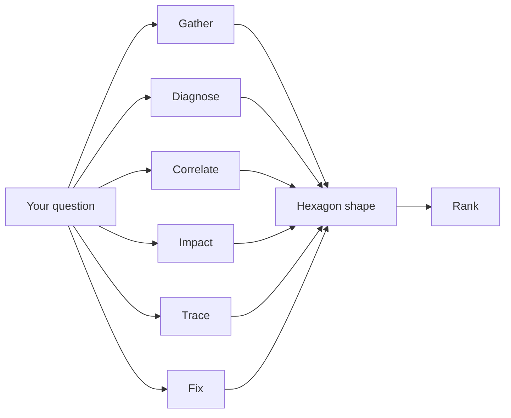
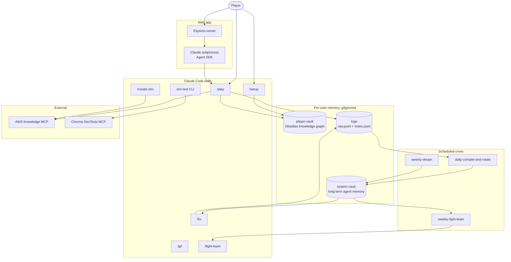

# AWS Incident Simulator

A game about learning to ask good questions.

## How to play

Clone the repo. Run `/setup` in Claude Code once. Then run `/play`.

## What it scores

The simulator grades the path, not the answer. Every question you ask is classified into one of six dimensions. Your rank is the shape of the hexagon they form, not a single score.

## How it fits together

## The pieces

**Player vault.** The player's own Obsidian knowledge graph: session journals, concept notes, service pages, behavioral patterns. One per player.

**System vault.** Long-term agent memory: findings, decisions, workarounds, components, dreams. Compiled daily from the logs.

**Logs.** One unified event stream (`raw.jsonl`) for every tool call and session event. A parallel semantic stream (`notes.jsonl`) for findings agents want to remember.

**Three test layers.** Deterministic unit tests, agent-driven browser tests via Chrome DevTools, and persona-based exploration tests. The browser layer is agent-in-the-loop on purpose.

**Hooks.** Every tool call, session event, warning, and error lands in the logs automatically. Both terminal `/play` and the web app write to the same file.

**Types everywhere.** TypeScript on the web, CLI, and scripts side, enforced by `tsc --noEmit`. Python with strict type hints on the data side, enforced by `mypy --strict`. The build itself catches "I forgot to update the consumer" bugs.

**Health score.** A composite across ten buckets. Floors only ever rise, so any regression trips an invariant.

**Fight-team.** Three agents (coordinator, Challenger, Defender) debate the top health findings weekly. Subagents agree too easily; adversarial pressure surfaces weak claims.

**Git as memory.** Every change is its own small commit, independently revertable. No squash merges, ever. Worktrees keep parallel branches isolated.

**Verification by separate agents.** Whoever wrote a change does not verify it. A fresh subagent reads the diff and runs the tests.

**Built with the Agent SDK.** The web app is the only entry point for play sessions. It spawns a Claude subprocess per session via `@anthropic-ai/claude-agent-sdk`. Play sessions use Sonnet for fast interactive narration. Post-session learning analysis (knowledge scoring, profile updates, vault note compilation) runs as a separate Opus subprocess for the deeper cross-file reasoning. Both models are set in `web/lib/claude-process.ts`.

**Evals.** Sixty graded checks across eleven categories: scoring integrity, console purity, leak prevention, coaching accuracy, hint delivery, question classification, session integrity, narrator quality, and more. The deterministic checks read session JSON and transcripts; the LLM-graded ones rate narrative coherence, immersion, pacing, tone, and player agency. Run them with `sim-test evals`.

**Scheduled crons.** Three RemoteTrigger crons keep the system maintaining itself: a daily compile rolls `raw.jsonl` and `notes.jsonl` into the system vault and rotates the logs, a weekly dream consolidates the system vault, and a weekly fight-team debate files copy-paste-ready GitHub Issues from the top health findings. Each cron declares its own `allowed_tools` so unattended runs never prompt.

**MCP integration.** The play skill and the sim author both query the AWS Knowledge MCP server for source-of-truth AWS facts, so the best practices the simulator teaches stay current with real AWS behavior. The browser test layer drives a real Chromium instance through the Chrome DevTools MCP server, so UI assertions land against the actual DOM, not a JSDOM polyfill.

**Sim authoring agent.** A `/create-sim` skill generates new simulation packages: it picks an under-represented service from the catalog, drafts a story, generates fix criteria, hints, and narrator beats, and writes the manifest. The system can grow itself.

## Read more

The C4-style component diagram and impact-analysis guide is in `references/architecture/workspace-map.md`. The canonical commit and test workflow is in `references/architecture/core-workflow.md`. Run `npm run doctor` for a one-shot health check across every moving part.
