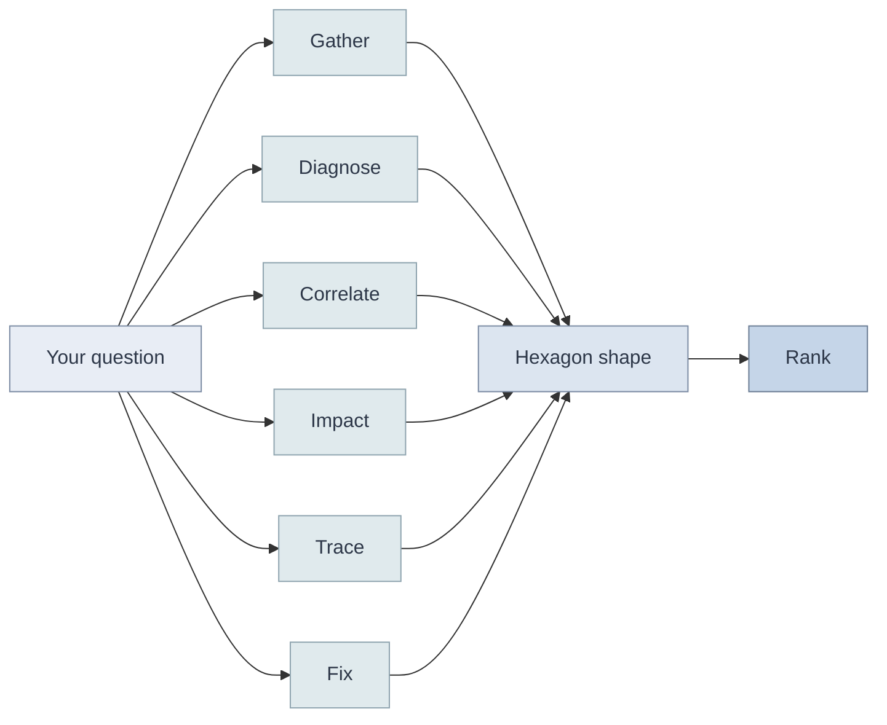
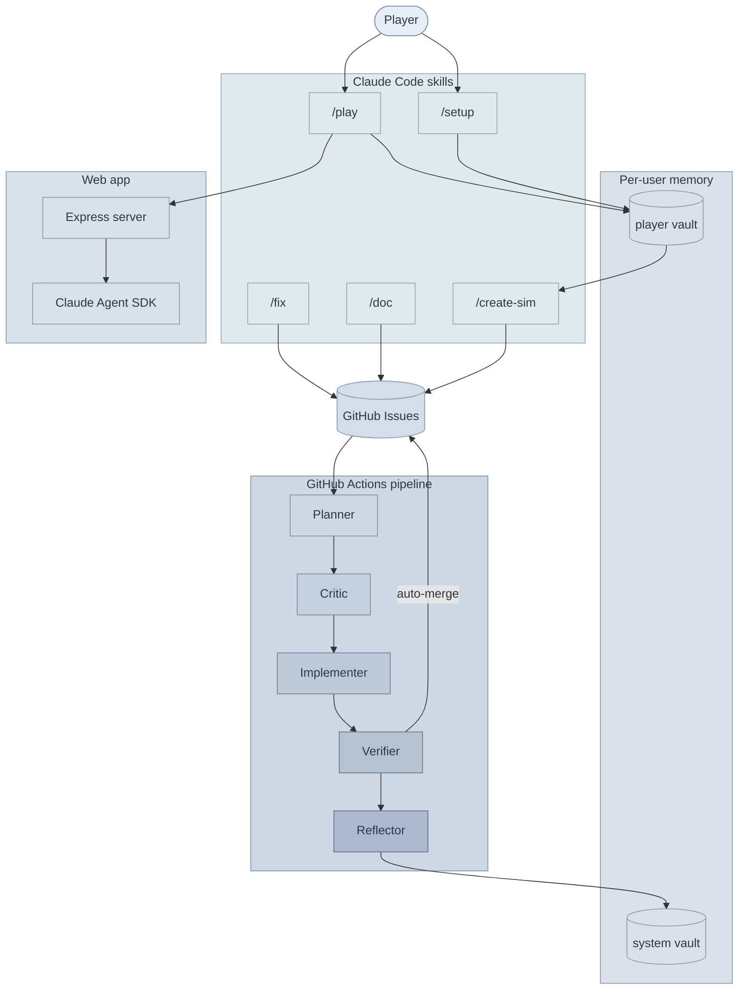

# AWS Incident Simulator

A game about learning to ask good questions.

## How to play

Clone the repo. Run `/setup` in Claude Code once. Then run `/play`.

## What it scores

The simulator grades the path, not the answer. Every question you ask is classified into one of six dimensions. Your rank is the shape of the hexagon they form, not a single score.

## How it fits together

## The pieces

**Player vault.** Your personal knowledge graph. Session journals, concept notes, service pages, behavioral patterns. One per player, grows with you.

**System vault.** Long-term agent memory. What the system has learned about itself: findings, decisions, workarounds.

**Web app.** The play interface. Built with the Anthropic Agent SDK. Sonnet handles interactive narration. Opus handles post-session learning analysis.

**Pipeline.** The pipeline uses different Claude models per stage, with Opus reserved for reasoning-heavy work. Label an issue `needs-plan` and the pipeline takes over. A planner posts a structured plan, then the issue flips to `needs-critique`. An Opus critic challenges it adversarially and either approves (`needs-impl`) or bounces it back (`needs-plan`). An implementer writes the code with TDD, pushes a branch, and flips to `needs-verify`. A verifier checks the diff against the plan, runs every test suite, opens a PR, auto-merges, and flips to `needs-reflection`. An Opus pass on `needs-reflection` reads the full issue chain and writes learnings into the shared system vault. The whole cycle runs without human intervention.

**Testing.** Deterministic unit tests run on every PR in CI. Agent-in-the-loop browser tests drive a real Chromium instance through Chrome DevTools MCP, so UI assertions land against the actual DOM. Sixty eval checks grade scoring integrity, coaching accuracy, hint delivery, and narrator quality.

**Health score.** A composite across ten buckets that measures code quality. Floors only ever rise, so regressions are caught automatically.

**Sim authoring.** The `/create-sim` skill reads your player vault to find confusion patterns and weak dimensions, then generates scenarios targeting your specific gaps. Personalized learning, not random coverage.

**MCP integration.** The simulator queries the AWS Knowledge MCP server for real AWS facts, so the best practices it teaches stay current.

**Types everywhere.** TypeScript on the web side, Python with strict type hints on the data side. Both enforced by their respective type checkers in CI.
