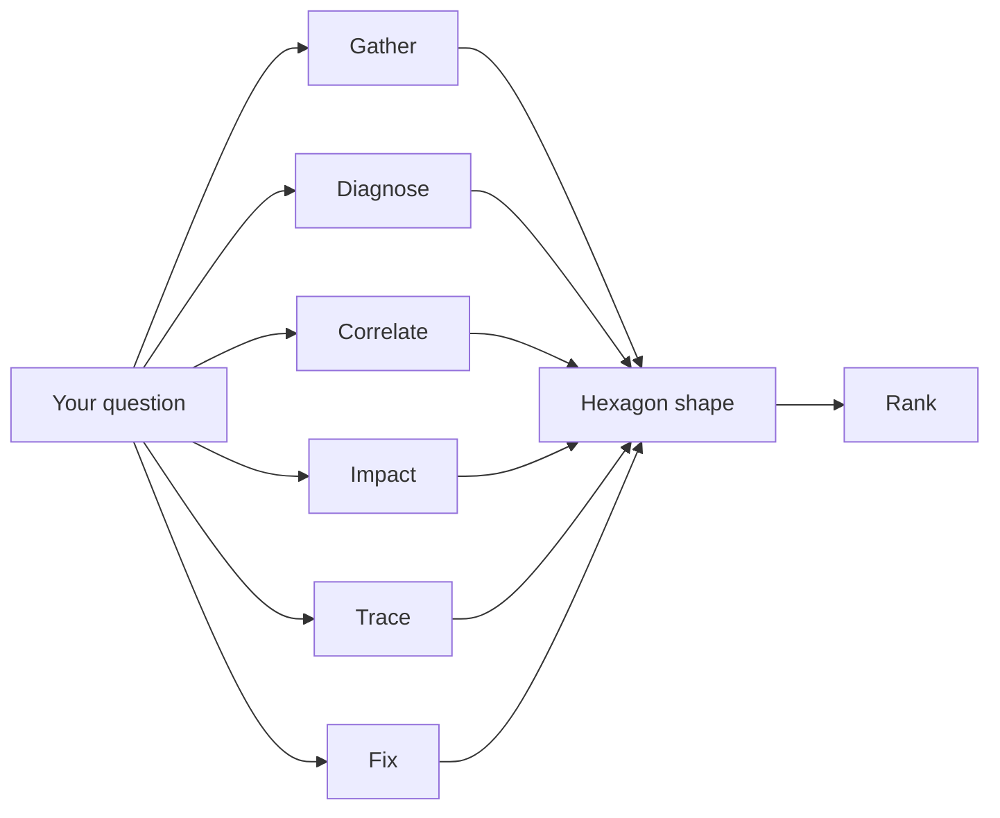
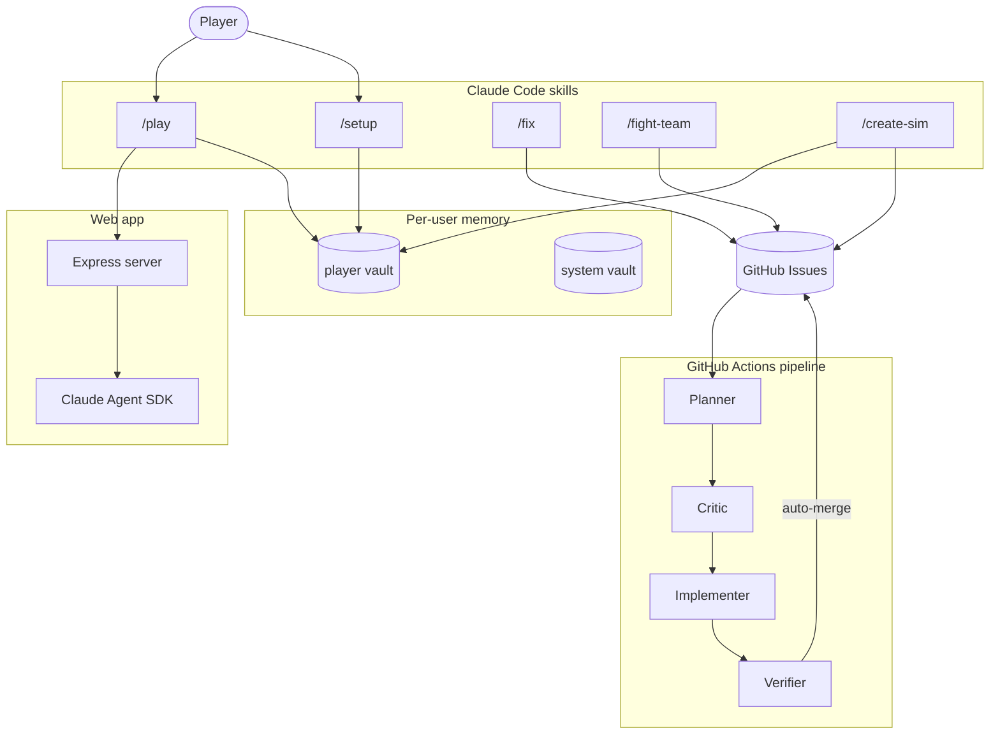

# AWS Incident Simulator

A game about learning to ask good questions.

## How to play

Clone the repo. Run `/setup` in Claude Code once. Then run `/play`.

## What it scores

The simulator grades the path, not the answer. Every question you ask is classified into one of six dimensions. Your rank is the shape of the hexagon they form, not a single score.

## How it fits together

## The pieces

**Player vault.** Your personal knowledge graph. Session journals, concept notes, service pages, behavioral patterns. One per player, grows with you.

**System vault.** Long-term agent memory. What the system has learned about itself: findings, decisions, workarounds.

**Web app.** The play interface. Built with the Anthropic Agent SDK. Sonnet handles interactive narration. Opus handles post-session learning analysis.

**Pipeline.** Every improvement flows through four GitHub Actions stages: a planner drafts the change, a critic challenges it, an implementer writes the code, and a verifier checks the work and merges automatically. You trigger it by labeling an issue `needs-plan`.

**Testing.** Deterministic unit tests run on every PR in CI. Agent-in-the-loop browser tests drive a real Chromium instance through Chrome DevTools MCP, so UI assertions land against the actual DOM. Sixty eval checks grade scoring integrity, coaching accuracy, hint delivery, and narrator quality.

**Adaptive hints.** Pre-authored hints trigger after unproductive questions, delivered in order from vague to specific. Hints skip automatically if the player already queried the relevant service.

**Question quality.** Every question is scored on four dimensions: specificity, relevance, building on prior data, and targeting a specific service aspect. These feed directly into the hexagon polygon that determines your rank.

**Spaced repetition.** Sim selection weights stale concepts higher using modified Fibonacci intervals. Services you haven't practiced recently surface first.

**Difficulty pacing.** Within each rank, difficulty oscillates between challenge and consolidation to keep you in flow state. Rank advancement requires sustained quality, not grinding.

**Debrief.** After each sim, a three-stage debrief validates your understanding: summarize the root cause in one sentence, answer seed questions derived from learning objectives, then discuss.

**Health score.** A composite across ten buckets that measures code quality. Floors only ever rise, so regressions are caught automatically.

**Sim authoring.** The `/create-sim` skill reads your player vault to find confusion patterns and weak dimensions, then generates scenarios targeting your specific gaps. Personalized learning, not random coverage.

**MCP integration.** The simulator queries the AWS Knowledge MCP server for real AWS facts, so the best practices it teaches stay current.

**Types everywhere.** TypeScript on the web side, Python with strict type hints on the data side. Both enforced by their respective type checkers in CI.
